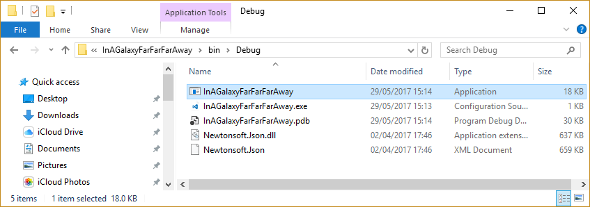
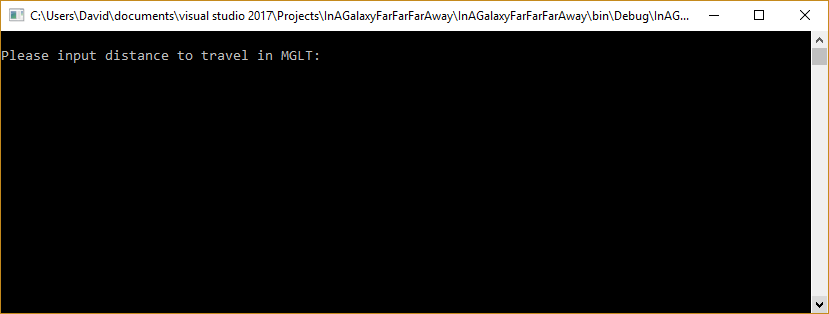
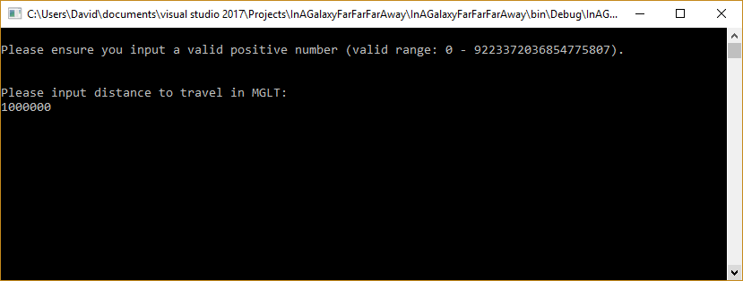
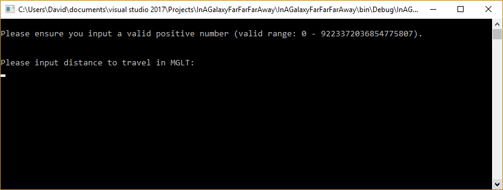
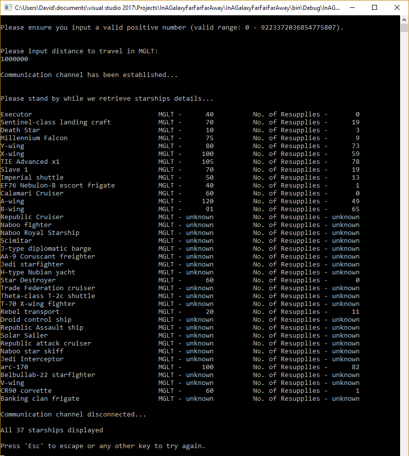
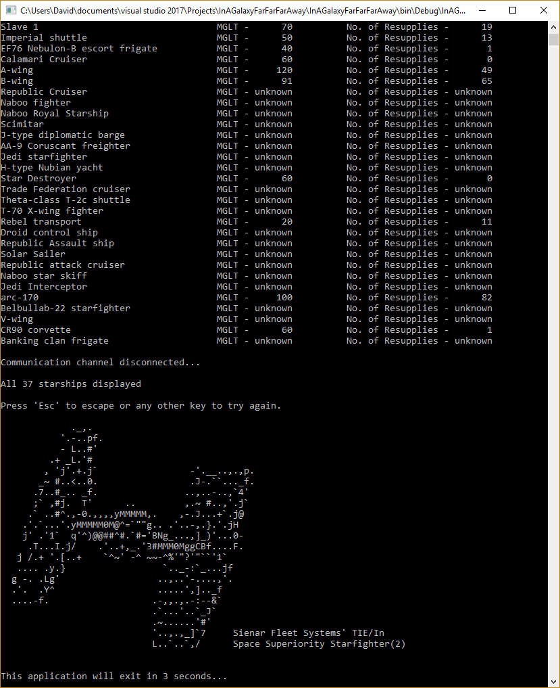

In A Galaxy Far Far Away
========================

Overview
--------
The solution satisfies the requirements of the coding challenge by means of several asynchronous calls.  

Once each response is received, the number off re-supplies required for each star-ship to travel the desired distance is calculated.  There are also a number of unit test include which assert various inputs, valid or otherwise.  

In addition, I have included a test to verify that the URL supplied returns a successful response. 

Running the console application
-------------------------------
You may run the application from either the IDE or you can locate the **InAGalaxyFarFarFarAway** application under the bin folder for your chosen solution configuration. 

  

Usage
-----
Once the application starts, the user will be prompted to enter the distance to travel in MGLT.  

  

Assuming the input entered is valid, the application will proceed to request information via the Star Wars API a.k.a SWAPI.  

  

If input is invalid, the user will prompted to re-enter a valid input, along with a further description of what is in fact valid.

  

Assuming communication is possible and input is valid, the application will attempt to interact with the SWAPI.

Once each call is complete, the output is written to the console. 

Once all calls have been complete, a counter is ouput to indicate the number of records processed.

  

If communication has not been possible, this is communicated to the user and the are given the option to try and to to escape from the application.

If 'Esc' is chosen, application automatically closes after 3 seconds.

  
  
   acsii art by Ray Brunner

