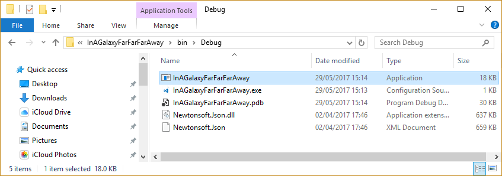
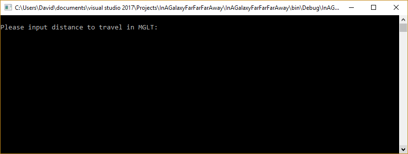
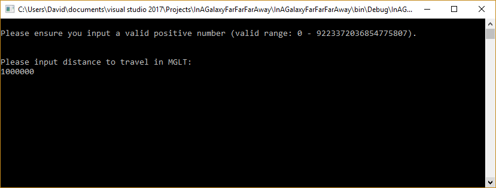
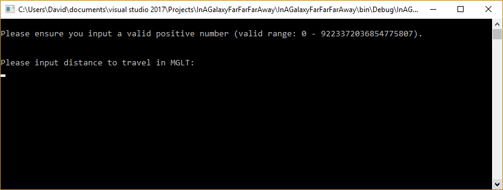
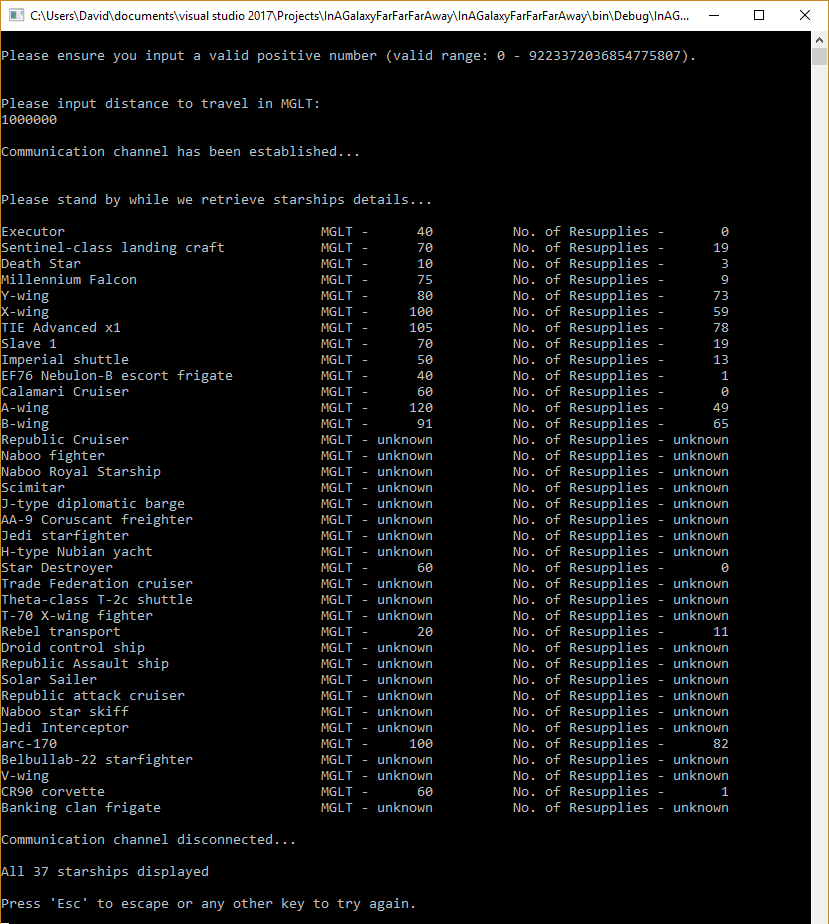
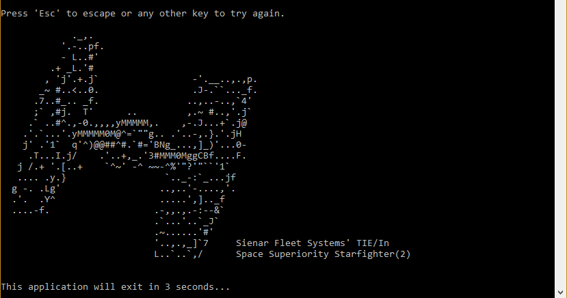

In A Galaxy Far Far Away
========================

Overview
--------
The challenge was to determine the number of stops each starship would need to make to restore supplies given a specific distance to travel. The solution utilises the [Star Wars API](http://swapi.co/). This provides all the relevant information required to make this calculation.

<strong>Calculation:</strong>  ( MGLT Input by User / ( Starship MGLT * ( Starship Consumables converted to hours) ) )

As the collection of starships is provided over a number of seperate pages, I decided to call and displayed the response asynchronously.

In addition, I have included a number of unit tests included within the project, which assert various inputs, valid or otherwise.  I have also included a test to verify that the URL supplied returns a successful response. 

NuGet Packages
--------------
The project already includes **Newtonsoft.Json v10.0.2**, which should be restored during the build process. 

If not, this will need to be installed via the **NuGet Package Manager**

Running the console application
-------------------------------
You may run **[F5]** the application from either **Visual Studio** or you can locate and run the **InAGalaxyFarFarFarAway** application from the bin folder for your chosen solution configuration. 

  

Instructions
------------
Once the application has started, the user will be prompted to enter the distance to travel in MGLT.  

  

Assuming the input entered is valid, the application will proceed to request information via the Star Wars API a.k.a SWAPI.  

  

If the input is invalid, the user will prompted to re-enter valid input. In addition to the original prompt, a further description of what is in fact valid is displayed.

  

Assuming the mechanism for sending HTTP requests and receiving HTTP responses can be instantiated, and inputted MGLT value is valid, the application will attempt to interact with the SWAPI.

Once each call is completed, the output is written to the console. 

Once all calls have been completed, a counter is ouputted to indicate the total number of records processed.

  

If communication has not been possible, this is communicated to the user and the are given the option to try and to to escape from the application.

If '**Esc**' is chosen, application automatically closes after 3 seconds.

  
  
acsii art by Ray Brunner

